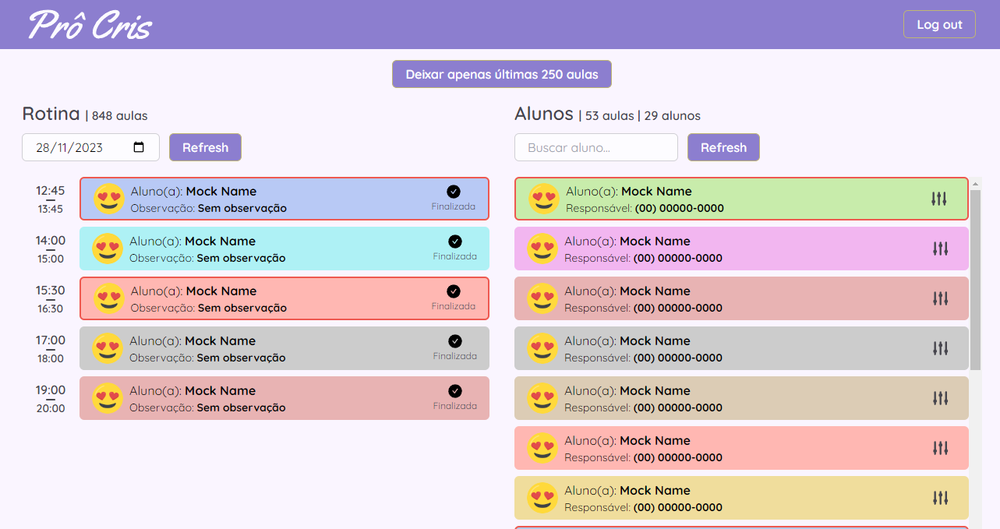

# Pro Cris Admin

An administrator website for managing complex tasks that cannot be done inside [Pro Cris App](https://github.com/irwinarruda/pro-cris-app-v2)

**Pro Cris Admin** is a small project to help me to learn SolidJS.

    

### Technologies

- [SolidJS](https://svelte.dev/) for the UI buinding.
- [Svelte Kit](https://kit.svelte.dev/) as the SSR provider.
- [Tailwind CSS](https://tailwindcss.com/) for styling.
